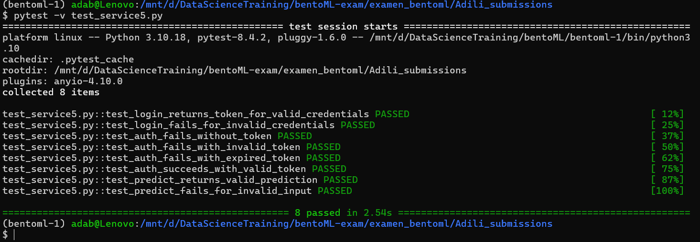

# Admission Prediction API — README

**Full name:** Adili abulatijiang

**Email:** ablat1329@gmail.com

## Deliverables Overview

This README contains all the commands to:

1. Load the BentoML Docker image
2. Run the containerized API
3. Run unit tests to verify API functionality

---

## Prerequisites

Before proceeding, ensure your system has the following installed:

- **Python 3.10**
- **Docker**
- **pytest 8.4.2**
- **httpx 0.28.1**
- **any other python libraries**, used for the bentoml venv is listed in the "**requirements.txt**"
- Internet connection (only for pulling base Docker images if missing)

Verify installations:

```bash
python --version
docker --version
pytest --version
```
---

## Step by step commands

First, load image to docker

```bash
docker load -i adili_bento-exam.tar
```
Second, run the container

```bash
docker run -d -p 3000:3000 bento-exam:v0
```
Third, after the container started, you can check the port 3000, on the browser
```bash
http://localhost:3000
```

Fourth, run the pytest
```bash
pytest -v test_service5.py
```

Test output from pytest as below:


